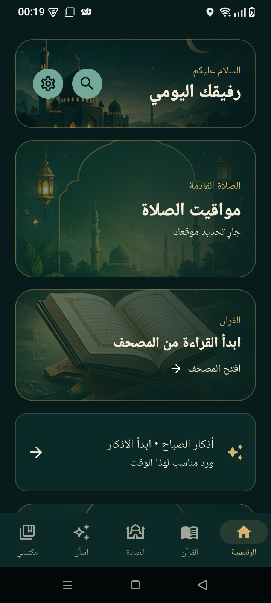
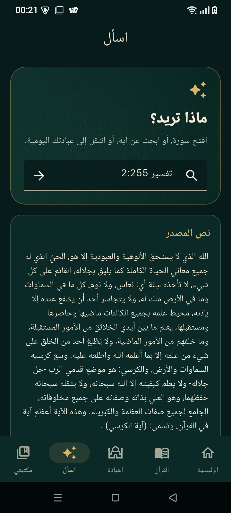
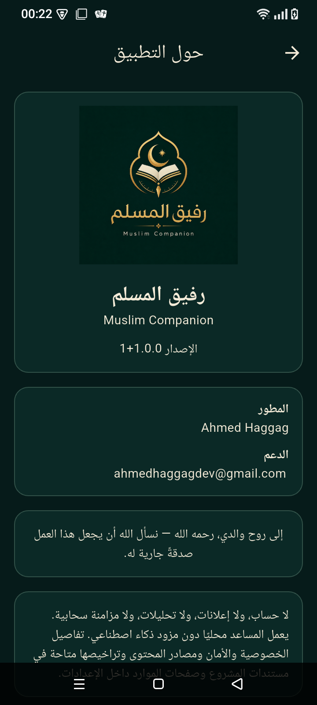

# رفيق المسلم · Muslim Companion

Arabic-first Quran and daily-worship Flutter application by Ahmed Haggag. It provides Quran reading/search, reflowable Mushaf navigation, verified translation/Tafsir/word meanings, streamed recitation, prayer/Qibla, Adhkar/Duas/Tasbeeh, Khatma, memorization, local backup, and a provider-free grounded Ask interface.


## Screenshots

| Home | Grounded Ask | About |
|---|---|---|
|  |  |  |

## Setup and validation

Install Flutter stable and an Android SDK, then run:

```text
flutter pub get
flutter analyze
flutter test --concurrency=1
flutter run
```

Android production signing is intentionally external; see `docs/ANDROID_RELEASE_SIGNING.md`. Never commit a keystore or credentials.

## Architecture and privacy

Feature modules live under `lib/features`, data models/repositories under `lib/data`, and services/navigation under `lib/core`. User state is local and versioned. No account, ads, analytics, cloud sync, or AI provider is configured. AlAdhan prayer lookup and EveryAyah streaming are the only runtime network services. See `docs/ARCHITECTURE.md`, `PRIVACY.md`, and `docs/THREAT_MODEL.md`.

## Content provenance and limitations

Canonical Quran and study/worship resources are checksum-validated and provenance-documented. Application source licensing is separate from third-party religious content; review `docs/CONTENT_LICENSE_MATRIX.md`, `docs/QURAN_RESOURCES.md`, `docs/QURAN_STUDY_RESOURCES.md`, and `docs/RELIGIOUS_CONTENT.md` before redistribution.

Mushaf text is reflowable rather than a licensed pixel-identical printed layout. Recitation is streaming-only because recording-specific download rights are unresolved. Token morphology remains excluded pending legal clarification. Ask does not issue fatwas or use model memory.

## Release status and screenshots

Android engineering validation is tracked in `docs/PROJECT_STATE.md`. Store signing, Play Console actions, a hosted privacy-policy URL and iOS hardware acceptance remain owner-controlled steps. The broader store capture plan is in `docs/store/SCREENSHOT_PLAN.md`; these engineering screenshots are not a substitute for final Play listing artwork.

Contributions must preserve Quran integrity and content provenance. Read `CONTRIBUTING.md`, `SECURITY.md`, and `CODE_OF_CONDUCT.md`. Support: ahmedhaggagdev@gmail.com.
